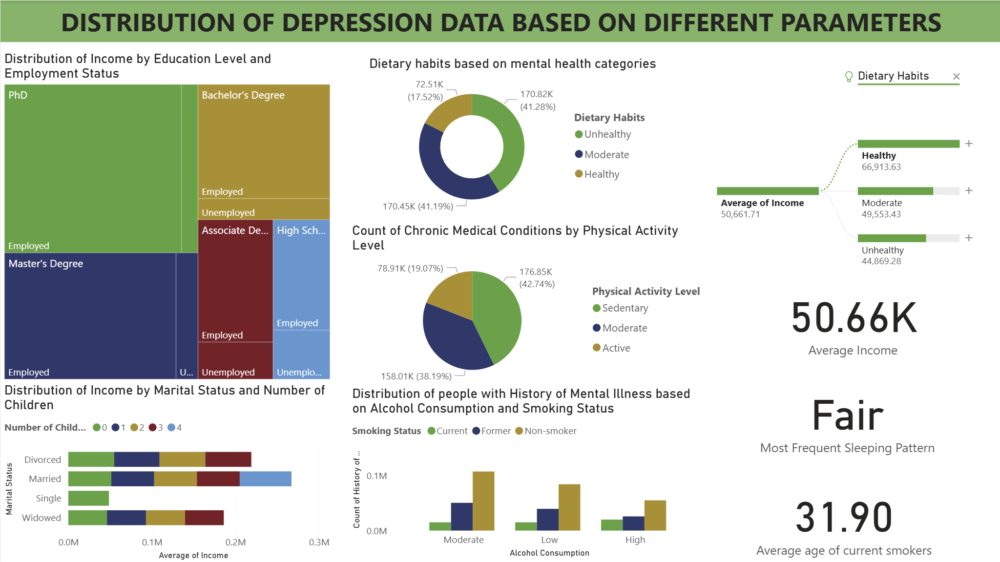
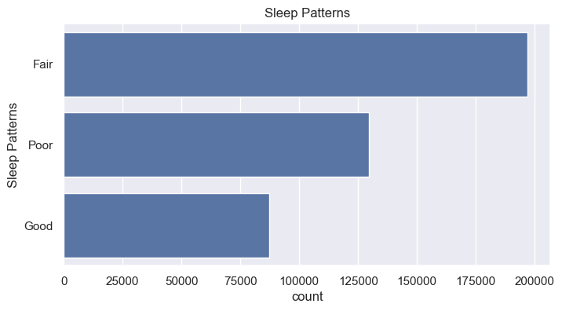
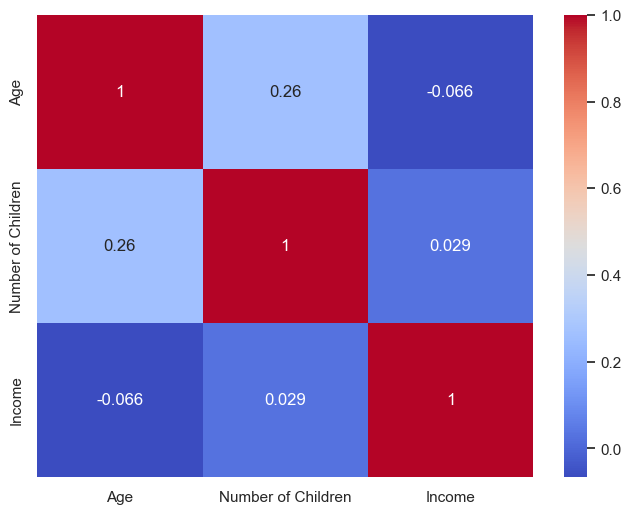
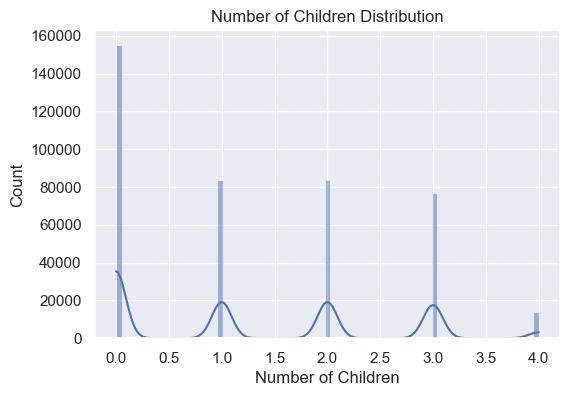
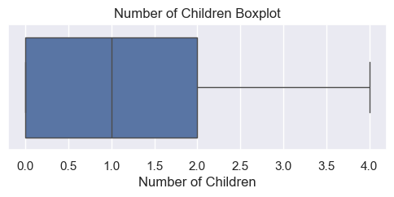
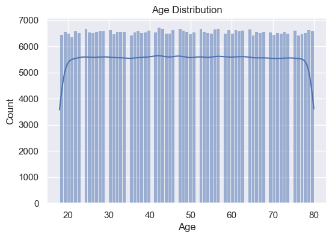

# 🧠 Chronic Depression Data Analysis

<div align="center">

### End-to-End Data Analytics Project using **Python • SQL • Power BI**

Analyzing demographic, lifestyle, and medical factors associated with chronic depression through exploratory data analysis, SQL-based business queries, and an interactive Power BI dashboard.


</div>

---

# 📌 Project Overview

Mental health disorders such as chronic depression are influenced by several demographic, behavioral, socioeconomic, and medical factors.

This project performs a complete **data analytics workflow** using **Python**, **MySQL**, and **Power BI** to explore depression-related patterns from a healthcare dataset containing **400,000+ records**.

The project demonstrates:

- Data Cleaning
- Exploratory Data Analysis (EDA)
- SQL Business Analysis
- Interactive Dashboard Development
- Data-Driven Insights

---

# 🎯 Objectives

- Perform comprehensive data cleaning and preprocessing.
- Explore demographic, lifestyle, and health-related variables.
- Analyze relationships between depression risk factors.
- Solve analytical business questions using SQL.
- Build an interactive Power BI dashboard.
- Generate actionable insights from healthcare data.

---

# 🛠️ Tech Stack

| Technology | Purpose |
|------------|----------|
| 🐍 Python | Data Cleaning & EDA |
| 🗄️ MySQL | Data Analysis |
| 📊 Power BI | Dashboard Development |
| 📑 Pandas | Data Manipulation |
| 📈 Matplotlib | Visualization |
| 🎨 Seaborn | Statistical Graphics |

---

# 📂 Project Structure

```text
chronic_depression_analysis/
│
├── images/
│   ├── dashboard.png
│   ├── image1.png
│   ├── image2.png
│   ├── image3.png
│   ├── image4.png
│   └── image5.png
│
├── Chronic_Depression_EDA.ipynb
├── depression_data.csv
├── depression_data_analysis.sql
├── depression.pbix
└── README.md
```

---

# 📊 Dataset Information

| Feature | Details |
|----------|----------|
| Dataset | Chronic Depression Dataset |
| Records | 400,000+ |
| Variables | 16 |
| Domain | Healthcare |
| Analysis Tools | Python, SQL, Power BI |

---

# 📋 Dataset Features

The dataset includes:

- Name
- Age
- Marital Status
- Education Level
- Number of Children
- Smoking Status
- Physical Activity Level
- Employment Status
- Income
- Alcohol Consumption
- Dietary Habits
- Sleep Patterns
- History of Mental Illness
- History of Substance Abuse
- Family History of Depression
- Chronic Medical Conditions

---

# 🧹 Data Cleaning

The dataset was cleaned and validated before analysis.

### Data Cleaning Steps

- ✔ Checked dataset dimensions
- ✔ Verified data types
- ✔ Removed duplicate records
- ✔ Checked missing values
- ✔ Generated descriptive statistics
- ✔ Validated numerical variables
- ✔ Inspected outliers using boxplots
- ✔ Converted categorical columns where necessary

---

# 📈 Exploratory Data Analysis

Python was used to explore the dataset through descriptive statistics and visualizations.

### Numerical Analysis

- Age Distribution
- Income Distribution
- Number of Children Distribution
- Boxplots
- Correlation Heatmap

### Categorical Analysis

- Marital Status
- Education Level
- Smoking Status
- Physical Activity Level
- Employment Status
- Alcohol Consumption
- Dietary Habits
- Sleep Patterns
- Family History of Depression
- History of Mental Illness
- History of Substance Abuse
- Chronic Medical Conditions

---

# 📊 Dashboard Preview

<p align="center">

</p>

---

# 📈 Sample EDA Visualizations

## Income Distribution

<p align="center">

</p>

---

## Correlation Heatmap

<p align="center">

</p>

---

## Age Distribution

<p align="center">

</p>

---

## Income Boxplot

<p align="center">

</p>

---

## Age Boxplot

<p align="center">

</p>

---

# 💻 SQL Analysis

The following business questions were solved using SQL.

### ✔ Average Income by Age Group

Analyzed average income across different age categories.

---

### ✔ Average Income by Marital Status

Compared average income among different marital groups.

---

### ✔ Smoking Status vs Physical Activity

Analyzed lifestyle behaviors and physical activity patterns.

---

### ✔ Employment Status vs Income

Compared average income between employed and unemployed populations.

---

### ✔ Chronic Medical Condition Analysis

Measured prevalence of chronic diseases.

---

### ✔ Physical Activity vs Sleep Patterns

Studied the relationship between exercise and sleeping behavior.

---

### ✔ Dietary Habits vs Chronic Conditions

Explored dietary patterns associated with chronic illnesses.

---

### ✔ Lifestyle Risk Segmentation

Created a lifestyle risk indicator using:

- Smoking Status
- Alcohol Consumption
- Physical Activity Level

---

### ✔ Family Health Risk Indicator

Generated a Family Health Risk variable using:

- Family History of Depression
- Chronic Medical Conditions

---

### ✔ Highest Smoking Age Group

Identified age groups with the highest number of smokers.

---

### ✔ Mental Illness vs Substance Abuse

Measured overlap between mental illness history and substance abuse.

---

### ✔ Income vs Mental Illness Correlation

Performed correlation analysis between income and history of mental illness.

---

# 📊 Power BI Dashboard Features

The interactive dashboard enables users to explore depression-related trends through dynamic filtering and visual analytics.

### Dashboard Includes

- KPI Cards
- Income Analysis
- Age Analysis
- Smoking Analysis
- Physical Activity Trends
- Lifestyle Risk Segmentation
- Medical History Analysis
- Family Health Indicators
- Interactive Filters
- Dynamic Visualizations

---

# 🔍 Key Insights

- Most individuals fall within middle-income categories, while high-income observations are comparatively fewer.
- Lifestyle behaviors such as smoking and alcohol consumption are frequently associated with lower physical activity levels.
- Chronic medical conditions commonly coexist with a family history of depression.
- Sleep quality appears closely related to physical activity patterns.
- Income shows only a weak relationship with mental illness history, indicating that depression is influenced by multiple interacting demographic, lifestyle, and medical factors.
- Feature engineering through Lifestyle Risk and Family Health Risk provides meaningful segmentation for identifying vulnerable populations.

---

# 🚀 Future Scope

- Machine Learning Prediction Models
- Depression Risk Classification
- Streamlit Web Application
- Automated ETL Pipeline
- Cloud Deployment
- Advanced Statistical Analysis

---

# 📚 Skills Demonstrated

- Data Cleaning
- Exploratory Data Analysis
- SQL Query Writing
- Feature Engineering
- Healthcare Analytics
- Business Intelligence
- Dashboard Design
- Data Visualization
- Statistical Analysis

---

# 👨‍💻 Author

## **Ankita Paul**

**Electrical Engineering Undergraduate**  
**National Institute of Technology Agartala**

---

## ⭐ If you found this project helpful, consider giving it a Star!
